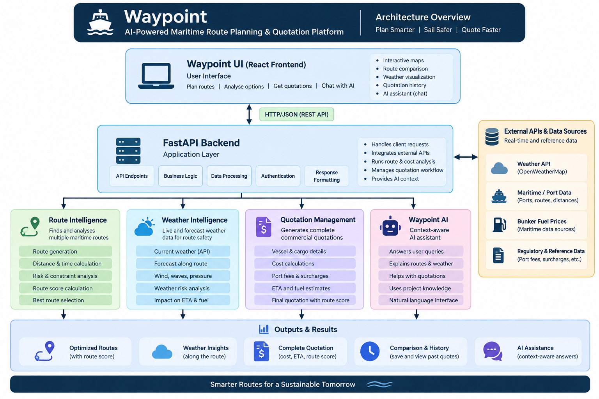
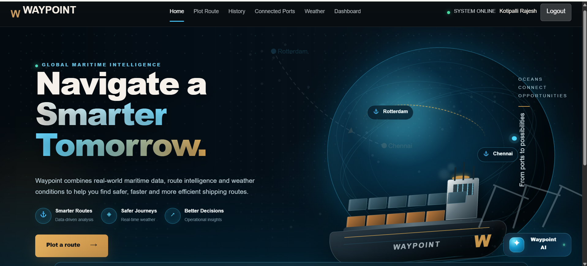
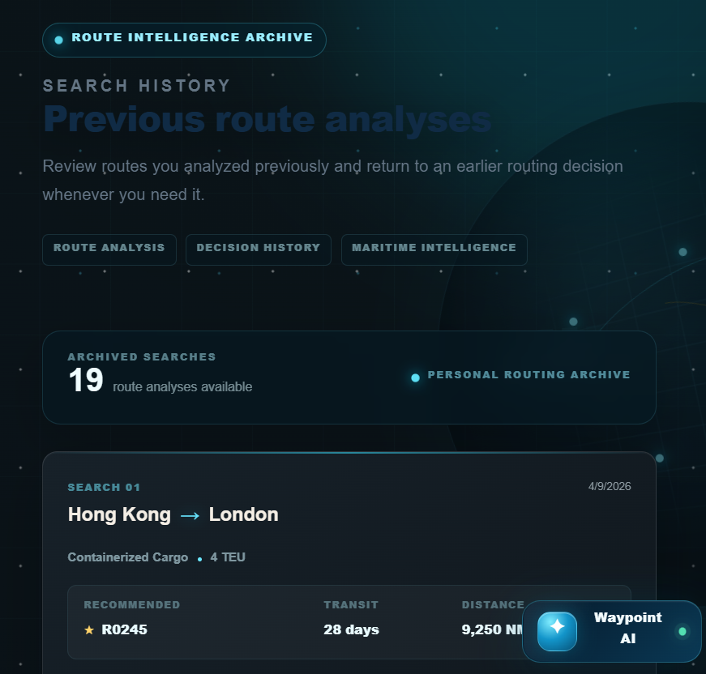
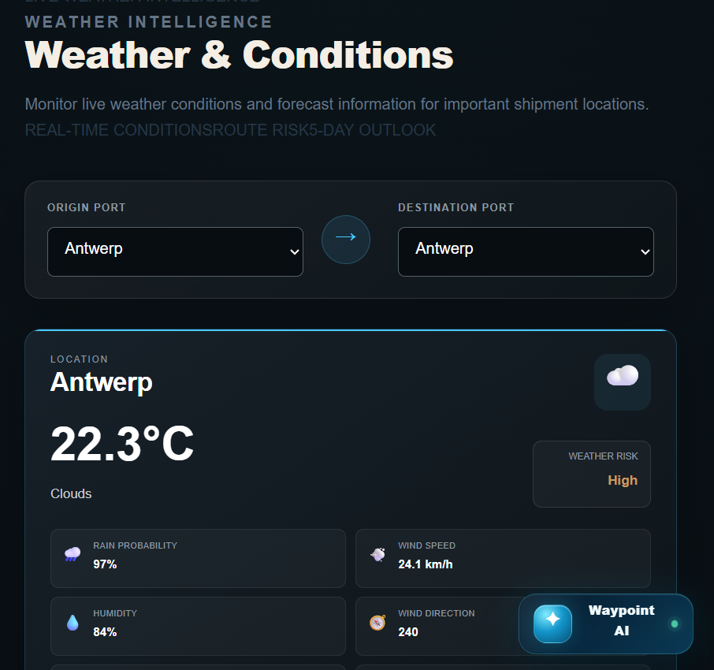
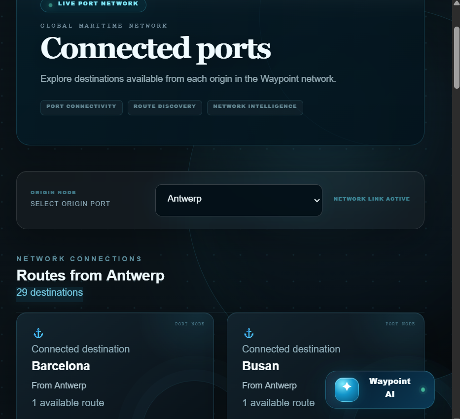
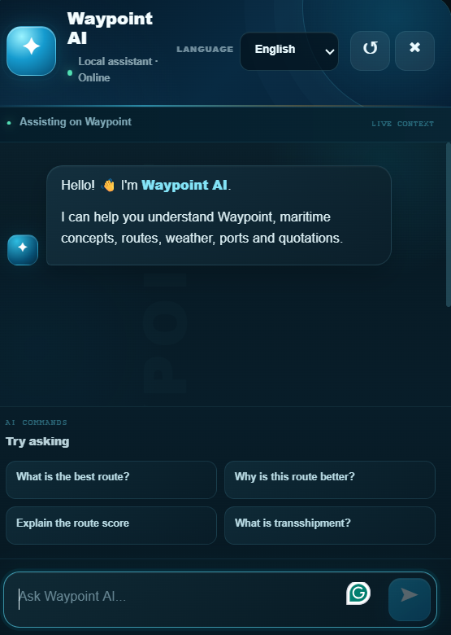
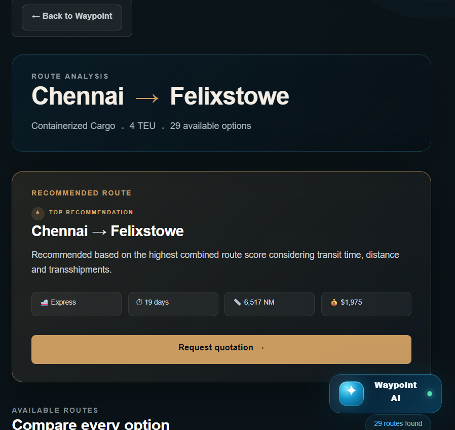

# ⚓ Waypoint --- AI-Assisted Maritime Brokerage Platform

> **Navigate a Smarter Tomorrow.**

Waypoint is an AI-assisted maritime brokerage platform designed to
simplify and digitize marine route analysis, port connectivity, weather
assessment, quotation management, search history, and operational
monitoring.

## 🌊 Overview

The platform brings multiple maritime intelligence capabilities into one
application:

-   🚢 Route intelligence
-   🌦️ Maritime weather information
-   ⚓ Connected-port discovery
-   💼 Digital quotation requests
-   🗂️ Search history
-   📊 Operations analytics
-   🤖 Multilingual, context-aware AI assistance

## 🎯 Problem Statement

Traditional maritime brokerage workflows can involve:

-   **Manual route planning** --- comparing routes and operational
    factors manually.
-   **Fragmented information** --- route, weather, port, and operational
    information may be spread across different sources.
-   **Manual quotation processes** --- quotation requests require
    repeated manual data entry and coordination.
-   **Limited operational visibility** --- decision-makers may lack a
    centralized operational view.
-   **Limited intelligent assistance** --- users often have to interpret
    maritime information themselves.

## 💡 Proposed Solution

Waypoint provides a centralized digital platform for maritime
decision-making.

### Core objectives

  -----------------------------------------------------------------------
  Objective                           Capability
  ----------------------------------- -----------------------------------
  🚢 Intelligent Route Planning       Analyze available maritime routes
                                      and recommend a route

  ⚓ Port & Weather Intelligence      Explore connected ports and assess
                                      weather conditions

  💼 Digital Quotation Management     Request quotations after selecting
                                      a route

  📊 Operational Analytics            Monitor searches, routes,
                                      quotations, and activity

  🤖 AI-Powered Assistance            Ask Waypoint AI about routes,
                                      scores, weather, ports, and
                                      quotations
  -----------------------------------------------------------------------

## 🧠 Waypoint AI

Waypoint AI acts as an intelligent assistant inside the application.

Users can ask about:

-   Maritime concepts
-   Routes
-   Route scores
-   Transshipments
-   Weather
-   Ports
-   Quotations

### Context-aware AI

Unlike a conventional chatbot that mainly responds to the user's
message, Waypoint AI is designed to work with application context.

For example:

> **User:** "What is the best route?"

Instead of giving only a generic explanation, Waypoint AI can use the
current route information available in the application to provide a more
relevant response.

## 🗺️ Route Intelligence

The route analysis workflow evaluates available route options and
identifies a recommended route.

The route analysis interface presents information such as:

-   Origin and destination
-   Cargo type
-   Container quantity
-   Recommended route
-   Transit time
-   Distance
-   Route type
-   Freight information
-   Route score

The recommendation is based on the application's route-scoring logic,
considering transit time, distance, and transshipments.

## 🌦️ Weather Intelligence

Waypoint provides weather information for important shipment locations.

### Current conditions

The weather interface can display:

-   Temperature
-   Feels-like temperature
-   Humidity
-   Atmospheric pressure
-   Wind speed
-   Wind direction
-   Visibility
-   Weather condition
-   Precipitation / rain probability

### Forecast

The system also provides forecast information for future periods.

## ⚓ Connected Ports

Connected Ports provides port network intelligence.

Users can select an origin port and discover destinations connected
through the available route network.

The interface displays:

-   Origin port
-   Connected destinations
-   Number of routes
-   Network connections
-   Total connected destinations

## 💼 Digital Quotation System

After selecting a route, users can request a quotation digitally.

### Quotation inputs

-   Company name
-   Email
-   Phone
-   Origin
-   Destination
-   Route
-   Cargo type
-   Cargo weight
-   Container quantity
-   Special requirements

The quotation workflow is designed to connect route intelligence with
the commercial brokerage process.

## 🗂️ Search History

Waypoint automatically maintains previous route analyses.

Users can:

-   View previous searches
-   See origin and destination
-   View cargo information
-   See the recommended route
-   Review transit time
-   Review distance
-   Open detailed analysis
-   Delete previous searches

This provides a personal routing archive and makes it possible to return
to earlier routing decisions.

## 📊 Operations Dashboard

The Operations Dashboard provides a centralized view of operational
activity.

### KPI indicators

-   Total searches
-   Available routes
-   Best routes
-   Connected ports
-   Total quotations
-   Average transit time

### Analytics

-   Most searched routes
-   Quotation status distribution
-   Route ranking
-   Freight intelligence
-   Recent searches
-   Recent quotations
-   System status

## 🔐 Authentication & Security

The platform includes security mechanisms such as:

-   Password hashing
-   JWT authentication
-   Token-based API authorization
-   OTP verification
-   Protected user-specific history and quotations

> **Security note:** API keys, environment variables, virtual
> environments, databases, and other local secrets should remain
> excluded from the public repository through `.gitignore`.

## 🏗️ High-Level Architecture

## 🏗️ High-Level Architecture

The Waypoint platform follows a layered architecture connecting the React frontend, FastAPI backend, maritime intelligence services, quotation management, and context-aware Waypoint AI.




## 🔄 Application Data Flow

``` text
Customer / User Request
          ↓
     Route Analysis
          ↓
   Available Routes
          ↓
 Recommended Route + Route Score
          ↓
   Quotation Request
          ↓
 Commercial / Operational Processing
          ↓
      Final Quotation
```

## 🛠️ Technology Stack

### Frontend

-   React
-   Vite
-   JavaScript / JSX
-   CSS

### Backend

-   Python
-   FastAPI
-   Pydantic
-   Pandas

### Authentication & Security

-   JWT-based authentication
-   Password hashing
-   OTP verification
-   Token-based authorization

### Data & Intelligence

-   Maritime route dataset
-   Weather information
-   Route scoring
-   Operational analytics
-   Context-aware AI assistance

## 📁 Project Structure

``` text
AI_MARITIME_BROKAGE/
│
├── backend/
│   ├── app/
│   │   ├── agents/
│   │   │   ├── ai_agent.py
│   │   │   ├── rootagent.py
│   │   │   └── route_agent.py
│   │   ├── data/
│   │   │   └── routes.csv
│   │   ├── auth.py
│   │   ├── database.py
│   │   ├── history.py
│   │   ├── models.py
│   │   ├── otp.py
│   │   ├── quotation.py
│   │   └── security.py
│   └── main.py
│
├── frontend/
│   ├── public/
│   └── src/
│       ├── components/
│       ├── pages/
│       ├── App.jsx
│       ├── App.css
│       └── main.jsx
│
├── screenshots/
├── docs/
├── .gitignore
└── README.md
```

## ▶️ Running the Project Locally

### 1. Clone the repository

``` bash
git clone https://github.com/rajeshkotipalli/AI_MARITIME_BROKAGE.git
cd AI_MARITIME_BROKAGE
```

### 2. Backend setup

``` powershell
cd backend
python -m venv venv
.\venv\Scripts\Activate.ps1
pip install -r requirements.txt
```

If a `requirements.txt` file is not yet present, install the backend
dependencies used by the project and create the file before sharing
deployment instructions.

Create your local environment file:

``` text
backend/.env
```

Keep API keys and credentials inside `.env`; never commit them to
GitHub.

Start FastAPI:

``` powershell
python main.py
```

### 3. Frontend setup

Open another terminal:

``` powershell
cd frontend
npm install
npm run dev
```

Open the local Vite URL shown in the terminal.

## 🔌 API

The backend exposes the route analysis endpoint:

``` http
POST /api/routes/analyze
```

The endpoint accepts route request information such as:

``` json
{
  "origin": "Chennai",
  "destination": "Felixstowe",
  "cargo_type": "Containerized Cargo",
  "containers": 4
}
```

The response contains route-analysis information including the
recommended route, transit time, distance, transshipments, freight
information, and route score when the route is successfully analyzed.

## 📸 Application Screenshots

### Home --- Maritime Intelligence



### Route Analysis



### Connected Ports



### Weather Intelligence



### Search History



### Waypoint AI



## 📑 Project Presentation

The project presentation is included under:

``` text
docs/Waypoint_Project_Presentation.pptx
```

It covers the project introduction, problem statement, proposed
solution, architecture, authentication and security, Waypoint AI,
weather intelligence, connected ports, digital quotations, search
history, operations dashboard, data flow, and conclusion.

## 🚀 Future Enhancements

Potential future enhancements include:

-   More real-time maritime data integrations
-   Advanced route optimization
-   Expanded pricing intelligence
-   Automated quotation workflows
-   More operational forecasting
-   Additional AI-assisted brokerage capabilities
-   Production deployment and cloud infrastructure

## 👨‍💻 Project

**Waypoint --- AI-Assisted Maritime Brokerage Platform**

**Presented by:** Kotipalli Rajesh

The project demonstrates how modern web technologies, maritime datasets,
weather intelligence, and AI assistance can be integrated into a single
maritime brokerage platform.
